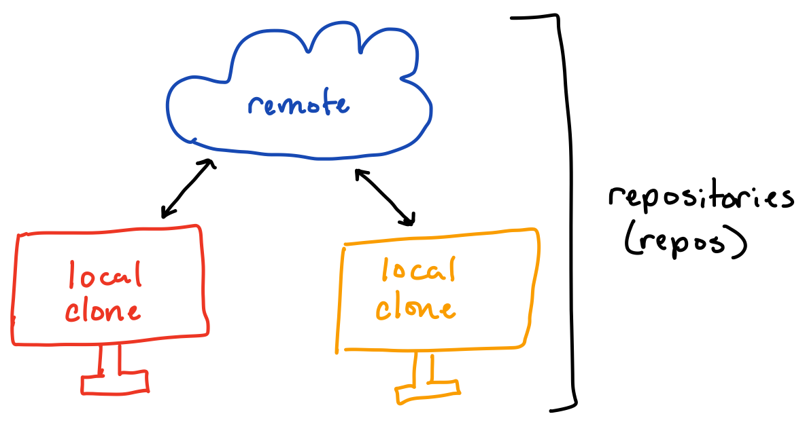

# example-project

[Cookiecutter](https://github.com/cookiecutter/cookiecutter) and [cruft](https://cruft.github.io/cruft/) are tools that make it easy to generate projects from reusable templates. This repo serves as a template for your project and offers some advice on best practices for deep learning and data science projects.

## Git for version control[^1]

[^1]: Adapted from [The Essentials of Git for Budding Data Scientists](https://www.dasca.org/world-of-data-science/article/the-essentials-of-git-for-budding-data-scientists)

Git is a version control system that allows you to easily track changes in you code while also facilitating collaboration on code-based projects. Git maintains a central repository ("origin" or "remote") while individual users work off a copy that they clone to their local machine ("local" or clone"). When users want to share changes they have made locally, they save the changes with a "commit" and "push" the changes back to the remote.

### Basic Terminology



__Repository__: Your project folder with versioned files and their history

__Clone__: A local copy of a repository

__Remote__: A copy of your code hosted online (usually by Github)


__Commit__: A single point in the Git repository history; the entire history of a repository is represented as a set of interrelated commits. Commits in git are defined relative to other commits,
so each commit represents a set of changes from the previous version.


__Branch__: A line of development, consisting of a series of commits. There is a "main" branch holding the stable code. Developers can create new branches when adding new features to avoid messing up the main branch until they are done testing, or to avoid conflicting with other developers. When ready, branches are "merged" back into main.


__Pull__: Retrieve changes from the remote and merge them into the local clone

__Push__: Share changes from the local clone to the remote

__Merge__: Combine changes from two branches

__Checkout__: Switch to a different branch or a previous commit

__Fetch__: Download changes from the remote without applying them to the local clone

### Basic git workflow


When you are working on a project versioned with git you will always follow the same basic routine.

1. Run `git pull` to check if there are any changes to the remote that need to be applied to your local clone
2. Make changes to your code
3. When you are ready to save your changes, run `git status` to check with files have changed
4. In order to tell git to track the changes, they need to be "staged". Run `git add path/to/file` to stage your changes for inclusion in the next commit
5. Run `git commit -m "<your commit message>"` to save your staged changes. Write a short message describing the changes you made in this commit.
6. `git push` to share the new commit with the remote repository

### Commit messages

Your commit messages serve as a record of your changes and thought process behind them. Future you always benefits from good commit messages! Read more [here](https://cbea.ms/git-commit/) about how to write good commit messages.

### Branching

When you are working in a group, each group member will usually develop code on their own branch. When a feature is complete, the branch can be merged into the `main` branch to share the changes with the rest of the group. To create a new branch run `git checkout -b <branch-name>`. Your branch name can describe the feature you are working on and include your username to identify the branch. For example, `username/metrics` or `username/dataloader`.

### What files can you track with git

Git is intended to be used to track relatively small text files. You should never add data or models to your git repository! Most repositories will include a `.gitignore` file with includes a list of file patterns that git should exclude from tracking, such as `*.zarr`, `*.tiff`, etc.

### Learn more about git

Your TAs are happy to answer questions about and help resolve problems with git during the course. You can learn more about git on your own through the following resources:

- [Learn Git Branching](https://learngitbranching.js.org/): An interactive visual website that teaches you how to use git.
- [`git gud`](https://github.com/benthayer/git-gud): An interactive CLI tool that features a progression of levels that teach you git skills.

## Specifying your environment

In order to ensure that your group members (and future you) can run your code, we will specify the set of python packages that are required for your code to run. It's also a good idea to make a note of what python version you are working with and cruft will prompt you to pick a python version when you are creating your project. We recommend choosing python 3.10 or greater, unless you need to use an older version for one of your dependencies.

The requirements for your code are specified in the `pyproject.toml` file in the dependencies section, which will look something like this:
```toml
dependencies = [
    "torch",
    "ipykernel",
    # Other packages that are needed to run your code
]
```
Commonly you will end up adding packages for visualization (`matplotlib` or `napari`) and data loading (`zarr`). Generally if you find yourself installing a package on the fly, remember to add it to your dependencies section.

## Organizing your code

### Common terminology[^2]

[^2]: Adapted from https://realpython.com/lessons/scripts-modules-packages-and-libraries/

__Script__: A Python file that’s intended to be run directly. They often contain code written outside the scope of classes or functions and might import modules, packages and libraries.

__Module__: A Python file that’s intended to be imported into scripts or other modules. It often defines classes, functions, and variables intended to be used in other files that import it.

__Package__: A collection of related modules that work together to provide certain functionality. These modules are contained within a folder and can be imported just like any other modules. This folder will often contain a special `__init__` file that tells Python it’s a package, potentially containing more modules nested within subfolders.

__Library__: An umbrella term that loosely means “a bundle of code.” These can have tens or even hundreds of individual modules that can provide a wide range of functionality.

### The role of notebooks

Notebooks are a great place to experiment, explore data and initially develop new code. In order to stay organized and keep track of your progress, we suggest treating each notebook like an entry in a lab notebook. Consider including the date in the name of the notebook and starting your notebook with a markdown cell that describes what you are working on in that notebook. Future you will thank past you when you are looking back through your notebooks and trying to figure out what you were thinking and working on.

As you are saving your model and other outputs, we suggest putting a timestamp in your filenames so that you don't accidentally overwrite the output of a previous experiment.
```python
import datetime

# Generate a time stamp with YYYYMMDD-HHMMSS
tstamp = datetime.datetime.now().strftime("%Y%m%d-%H%M%S")

model_path = f'ModelName-{tstamp}'
```

### When should code become src code

If you find yourself copying and pasting the same code from one notebook to another, it's time to move your code into a python module so that you can import it wherever you need it. You can find the first essential file in your module at `{{ project name }}/src/__init__.py`. The `__init__.py` is actually what makes something an installable python module. To add code to the module, in the  `src/project_name` folder, create a new file for your code. If your code is not already in a standalone function, rewrite it as a function and save it into your new file.

---

## Getting started on your project

### Connecting to Github through VSCode

For the purposes of this course, we recommend connecting to Github through the VSCode extension Github Pull Requests. After connecting to your remote machine through VSCode, you can install the Github Pull Requests extension from the marketplace. After it is installed, open the Github Pull Requests extension from the sidebar and select the "Sign In" button in order to authenticate VSCode to use your Github account. Once we are signed in to Github through the Github Pull Requests extension, we will just use the Source tab in VSCode.

We need to do one last configuration step before we are ready to use git from VSCode. Open a terminal in VSCode that is connected to your remote machine and run the following commands substituting in your information as needed.
```bash
git config --global user.email "your-email@email.com"
git config --global user.name "Your Name"
```

### Creating SSH Keys

If you have any issues with connecting to Github through VSCode, you can instead create an ssh key. For the course, you need to make an ssh key on your remote machine. From a terminal connected to your remote machine, follow these instructions to setup a key and connect it to github:
- [Generating a new ssh key](https://docs.github.com/en/authentication/connecting-to-github-with-ssh/generating-a-new-ssh-key-and-adding-it-to-the-ssh-agent#generating-a-new-ssh-key)
- [Adding your ssh key to the ssh agent](https://docs.github.com/en/authentication/connecting-to-github-with-ssh/generating-a-new-ssh-key-and-adding-it-to-the-ssh-agent#adding-your-ssh-key-to-the-ssh-agent)
- [Adding a new ssh key to your account](https://docs.github.com/en/authentication/connecting-to-github-with-ssh/adding-a-new-ssh-key-to-your-github-account#adding-a-new-ssh-key-to-your-account)
- [Testing your ssh connection](https://docs.github.com/en/authentication/connecting-to-github-with-ssh/testing-your-ssh-connection)

### Creating the project repo

Only one person needs to do these initial steps
1. Connect to your remote machine using the VSCode ssh extension.
2. Create your project repo using cruft. It will prompt you for series of values that it will use to complete the template.
```bash
pip install cruft
cruft create https://github.com/dlmbl/example-project
```
3. Open the source control extension and select "Publish to Github" button.

You are now ready to invite your group members to collaborate on your github repository for the project. Follow these [github instructions](https://docs.github.com/en/account-and-profile/setting-up-and-managing-your-personal-account-on-github/managing-access-to-your-personal-repositories/inviting-collaborators-to-a-personal-repository#inviting-a-collaborator-to-a-personal-repository) to add your group members to the project repo.

### Cloning your project repo

If you did not directly set up the project repo, you will need to clone it onto your remote machine. You can use the button with the option "Clone Repository" to look up your project repo once you have been added as a collaborator.

### Installing your repo

During the project phase, we will collect any reusable code into a python module. To import the resuable code from the module, you will need to install the module into your evironment.

First you will need to make a conda environment for your project and activate it. Then, from the folder containing your repository, run `pip install -e .`. The ` -e` flag tells pip to install the package in editable mode, which means that any changes you make to the code will be reflected in your environment. The `.` tells pip where to look (the current directory) for the `pyproject.toml` file which contains the configuration of your package including the dependencies that you have specified.

Now, you can import your functions using `from <package_name>.<file_name> import <function_name>`
at the top of your scripts and other files in the module. Any changes to the function will be automatically updated in the environment, and in notebooks if the autoreload extension is active.

---

# Additional Resources

[Cookiecutter for Data Science](https://cookiecutter-data-science.drivendata.org/): This is a more elaborate cookiecutter repo that is set up for a data science project. There are components that you don't need for your DL@MBL projects, but this is a great resource for features you might want to include in the future.